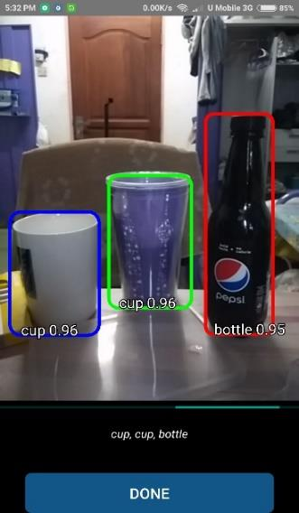
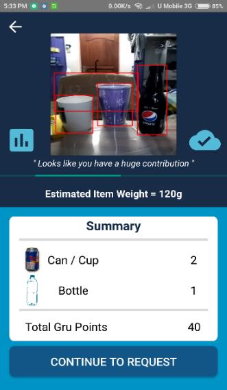

# GRU - Recycling
## Deep Learning Android Application
### Introduction:
This repository contains state of the art recycling android application that uses TensorFlow Lite deep learning framework to identify recyclable from camera and calculate the amount before send it over to recycling agent. 
### Core Features:
- Object Detection (TensorFlow-lite for Mobile)
- Automated Search and Navigation (UBER like)
- Points Collection System (Checkout System)
### Screenshots:

### Dependencies:
- Android Studio
- Tensorflow Android SDK
- Google Services
- Ubuntu 16.4
### How to use ?:
Check out the latest master branch and build it with your Andrioid Studio. It will take longer for the first run due to dependencies loading from google service for the deep learning application. The application is applicable to most android smart phone and it run at very high FPS. 
### Object Detection:
The object detection module uses TensorFlow-Lite framework that is optimized for mobile application and the backbone of the network uses SSD-7 architecture which built and trained entirely from scratch. From there, with TOCO 8-bit quantisation and network pruning process, our model able to show significant distinction in performance trade-off at the mobile platform level. Dataset wise, we use COCO as our primary input for the model training together with high degree of augmentation and additional local dataset. After a series of network optimizations, our model managed to achieve a good performance trade-off that able to execute high accuracy of detection by maintaining a rather high intermediate FPS for a standard mobile usage. 

 

As you can see on the images above, the object detection able to detect correctly for all objects in the images without having any mistakes together with object classification as well. This shows that the performance is highly comparable towards those detection running on PC or other high performance hardware inferences. Then, the android application tabulates the result from the model inference and compute the number of points that the users will receive. 
