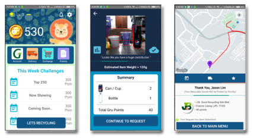

# GRU - Recycling
## Deep Learning Android Application
### Introduction:
This repository contains state of the art recycling android application that uses TensorFlow Lite deep learning framework to identify recyclable from camera and calculate the amount before send it over to recycling agent. 
### Core Features:
- Object Detection (TF-lite for Mobile)
- Automated Search and Navigation (UBER like)
- Points Collection System (Checkout System)
### Screenshots:

### Dependencies:
- Android Studio
- Tensorflow Android SDK
- Google Services
- Ubuntu 16
### How to use ?:
Check out the latest master branch and build it with your Andrioid Studio. It will take longer for the first run due to dependencies loading from google service for the deep learning application. The application is applicable to most android smart phone and it run at very high FPS. 
